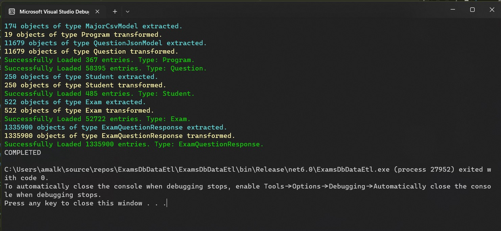

# Student Exam Database Data ETL
* Performs extraction, transformation and loading to populate a sample student examination database.

## Database Schema

| Table 	                   | Purpose                                                                         |
|----------------------------|---------------------------------------------------------------------------------|
| `program`                  | Represents an academic program offered at a university/educational institution. |
| `course`                   | Represents one of the courses under the program.                                |
| `program_course`           | Bridge table that defines the relationship between programs and courses.        |
| `student`                  | A student who enrolls in one or more programs.                                  |   
| `program_student`          | Bridge table that represents a registration of a student to a program.          |
| `instructor`               | An instructor who manages exams.                                                |
| `question`                 | A multiple-choice question that can be part of one or more exams.               |
| `answer`                   | One of the answers of a question.                                               |
| `exam`	                   | A scheduled exam.                                                               |
| `exam_question`	           | A question part of the exam.                                                    |
| `exam_question_response`   | A student response to a question part of the exam.                              |

- [DDL SQL Script](/ExamsDbDataEtl/SQL/create-tables.sql)

## Sources
### Data Generators
* The data for the student and instructors has been generated using using the data generator 
tool [generatedata.com](https://generatedata.com/).
* [`student` Insert Script](/ExamsDbDataEtl/SQL/student-insert.sql)
* [`instructor` Insert Script](/ExamsDbDataEtl/SQL/instructor-insert.sql)

### Datasets
1. [College Majors | Kaggle](https://www.kaggle.com/datasets/tunguz/college-majors)
* The programs and courses are extracted from the `majors-list.csv` file. 
* Each major is mapped to a record in the `course` table and the category is mapped to the `program` table.

2. [SciQ Dataset — Allen Institute for AI](https://allenai.org/data/sciq)
* The questions in the `train.json` file was deserialized and reshaped to populate the question and answer tables.
##  Output

